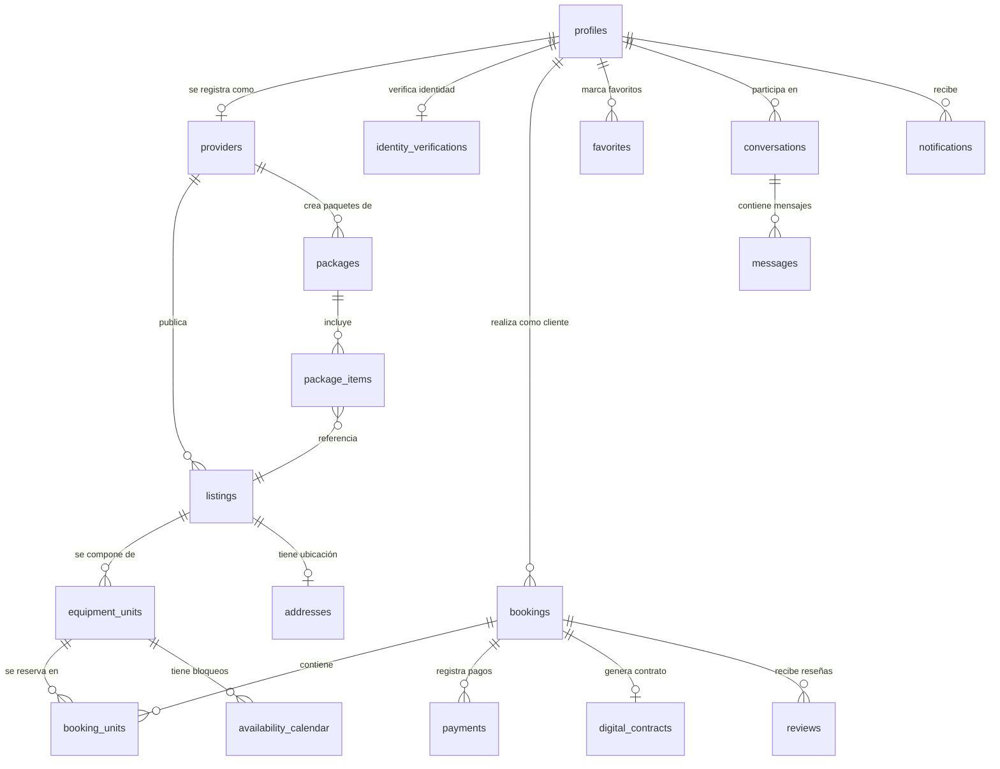

**By**: Jean Carlo Cuenca, Emilio Peña & Francisco Javier Jaramillo

**Marketplace SaaS de alquiler de equipos creativos para eventos.**

ArtRider conecta a propietarios de equipos de audio, iluminación, video y efectos especiales con organizadores de eventos que necesitan alquilarlos de forma segura, rápida y verificada.

---

## Tabla de Contenidos

1. [Stack Tecnológico](#-stack-tecnológico)
2. [Arquitectura del Proyecto](#-arquitectura-del-proyecto)
3. [Modelo de Base de Datos](#-modelo-de-base-de-datos)
4. [Funcionalidades Principales](#-funcionalidades-principales)
5. [Estructura del Código](#-estructura-del-código)
6. [Capa de Servicios (Server Actions)](#-capa-de-servicios-server-actions)
7. [Sistema de Seguridad (RLS)](#-sistema-de-seguridad-rls)
8. [Flujos Críticos de Negocio](#-flujos-críticos-de-negocio)
9. [Instalación y Configuración](#-instalación-y-configuración)
10. [Despliegue con Docker](#-despliegue-con-docker)
11. [Guía de Desarrollo](#-guía-de-desarrollo)

---

## Stack Tecnológico

| Capa              | Tecnología                                                                 |
|-------------------|----------------------------------------------------------------------------|
| **Framework**     | Next.js 16 (App Router) con React 19 y React Server Components (RSC)      |
| **Lenguaje**      | TypeScript 5.9 con tipado estricto                                         |
| **Estilos**       | TailwindCSS 4 + Shadcn/UI (estilo Radix Nova) + Framer Motion             |
| **Base de Datos** | Supabase (PostgreSQL) con Row Level Security (RLS)                         |
| **Autenticación** | Supabase Auth (email/password) con middleware de sesión por cookies        |
| **Pagos**         | Stripe (tarjetas internacionales) + Kushki (procesador latinoamericano)    |
| **KYC**           | Stripe Identity para verificación de identidad obligatoria                 |
| **Emails**        | Resend para correos transaccionales (solicitudes, confirmaciones, etc.)    |
| **Mapas**         | MapLibre GL + Leaflet + Google Maps API (selector de ubicación)            |
| **Iconografía**   | Lucide React                                                               |
| **Tipografía**    | Inter, Geist Sans, Geist Mono (Google Fonts)                               |
| **Gestión deps.** | pnpm 11                                                                    |
| **Contenedores**  | Docker (multi-stage) + Docker Compose                                      |

---

## Arquitectura del Proyecto

ArtRider sigue una **arquitectura de 3 capas** con separación estricta de responsabilidades:

```
┌─────────────────────────────────────────────────────────────┐
│                     CAPA DE PRESENTACIÓN                    │
│          app/ (Pages, Layouts, Loading, Error)               │
│          components/ (UI reutilizable + Features)            │
├─────────────────────────────────────────────────────────────┤
│                   CAPA DE LÓGICA DE NEGOCIO                 │
│         services/ (Server Actions con "use server")          │
│         Validación, cálculos, orquestación de datos          │
├─────────────────────────────────────────────────────────────┤
│                     CAPA DE DATOS                           │
│    lib/ (Clientes Supabase: Server, Admin, Browser)          │
│    Supabase PostgreSQL + Storage + Auth                      │
│    Integraciones externas (Stripe, Kushki, Resend)           │
└─────────────────────────────────────────────────────────────┘
```

### Convenciones del App Router

| Archivo             | Propósito                                                                       |
|---------------------|---------------------------------------------------------------------------------|
| `page.tsx`          | Vista/página renderizada como RSC (Server Component por defecto)                |
| `layout.tsx`        | UI compartida persistente entre sub-rutas (no se desmonta al navegar)           |
| `loading.tsx`       | Skeletons de carga automáticos vía React Suspense                               |
| `error.tsx`         | Error Boundary para captura y recovery de errores en runtime                    |
| `not-found.tsx`     | Interfaz personalizada para rutas/recursos 404                                  |
| `route.ts`          | Route Handler (API endpoints REST para webhooks y servicios externos)           |

---

## Modelo de Base de Datos

El diseño relacional separa la **oferta comercial** (`listings`) de la **existencia física** (`equipment_units`), permitiendo inventario granular y escalable.



### Entidades Principales

| Tabla                    | Descripción                                                                                       |
|--------------------------|---------------------------------------------------------------------------------------------------|
| `profiles`               | Datos del usuario vinculados a Supabase Auth (nombre, teléfono, avatar, fecha nacimiento)         |
| `providers`              | Extensión de negocio del usuario (`pending` → `active` → `suspended`)                             |
| `identity_verifications` | Estado KYC del usuario (`pending` / `verified` / `rejected`)                                      |
| `listings`               | Oferta comercial de equipo (título, marca, modelo, categoría, precio/día en centavos)             |
| `equipment_units`        | Inventario físico real con número de serie y estado (`AVAILABLE` / `MAINTENANCE` / `RETIRED`)     |
| `packages`               | Paquetes de equipos agrupados con precio especial                                                 |
| `package_items`          | Relación intermedia paquete ↔ listing                                                             |
| `bookings`               | Cabecera de reserva con snapshots JSONB inmutables del listing, dirección y proveedor              |
| `booking_units`          | Detalle que vincula una reserva con la unidad física exacta y congela el precio/día               |
| `availability_calendar`  | Bloqueos manuales del proveedor (mantenimiento, uso privado) con exclusión GiST                   |
| `payments`               | Registro de pagos (Stripe/Kushki) con estados `AUTHORIZED` / `CAPTURED` / `REFUNDED`             |
| `digital_contracts`      | Contratos digitales con hash y snapshot completo del booking                                      |
| `conversations`          | Hilos de chat entre cliente y proveedor, vinculables a listing/booking                            |
| `messages`               | Mensajes individuales con estado de lectura                                                       |
| `reviews`                | Reseñas bidireccionales (cliente→proveedor, proveedor→cliente)                                    |
| `favorites`              | Favoritos polimórficos (equipos y paquetes) con constraint `unique(usuario_id, item_id, tipo)`    |
| `notifications`          | Notificaciones in-app (solicitudes, confirmaciones, cancelaciones, reseñas)                       |
| `catalog_items`          | **Vista SQL unificada** (UNION de listings + packages) para búsqueda polimórfica                  |

---

## Funcionalidades Principales

### Para Clientes
- **Exploración** — Catálogo público con filtros por categoría, ciudad, precio y búsqueda de texto
- **Mapa interactivo** — Visualización geolocalizada de equipos disponibles (MapLibre GL)
- **Reservas inteligentes** — Selector de fechas con validación timezone-safe y resolución de rangos cruzados
- **Checkout seguro** — Pagos vía Stripe y Kushki con cálculo automático de comisión (5%)
- **Mensajería directa** — Chat en tiempo real con proveedores (archivado, eliminación suave)
- **Favoritos** — Guardar equipos y paquetes con toggle optimista
- **Reseñas** — Sistema bidireccional de calificaciones post-alquiler
- **Notificaciones** — Centro de notificaciones in-app con contador de no leídas
- **Perfil** — Gestión de datos personales con avatar (cooldown de 24h para cambios de foto)

### Para Proveedores
- **Catálogo** — CRUD completo de equipos y paquetes con publicación controlada
- **Dashboard** — Panel con métricas de reservas entrantes y estado de cada alquiler
- **Marca** — Nombre de negocio personalizable (brand_name)
- **Gestión de reservas** — Aceptar, rechazar, completar y archivar reservas con flujo de reseña obligatorio
- **Ubicación** — Selector de ubicación con mapa interactivo y geocoding
- **Galería** — Imagen de portada + hasta 5 imágenes de galería por equipo

### De Plataforma
- **Autenticación** — Registro con validación de edad (18+), login con redirect inteligente
- **Middleware de sesión** — Proxy de autenticación que protege rutas y refresca tokens
- **Emails transaccionales** — Notificaciones automáticas vía Resend (solicitud, confirmación, cancelación)
- **Inmutabilidad contractual** — Snapshots JSONB + triggers PostgreSQL que bloquean mutaciones post-firma
- **Rendimiento** — Notificaciones fire-and-forget (IIFE async) para checkout en <50ms
- **Docker** — Despliegue containerizado con multi-stage build (Node 20 Alpine)

---

## Estructura del Código

```bash
art-rider/
├── app/                          # Capa de Presentación (Next.js App Router)
│   ├── (auth)/                   #   Login y Register
│   │   ├── login/
│   │   └── register/
│   ├── api/                      #   Route Handlers (REST endpoints)
│   │   ├── stripe/               #     Webhooks y verificación Stripe
│   │   └── kushki/               #     Cobros Kushki
│   ├── bookings/                 #   Flujo de confirmación de reservas
│   ├── checkout/[id]/            #   Proceso de pago
│   ├── dashboard/                #   Dashboard del Cliente
│   │   ├── bookings/             #     Mis reservas
│   │   └── favorites/            #     Mis favoritos
│   ├── explore/                  #   Búsqueda y exploración del catálogo
│   ├── listings/                 #   Catálogo público y detalle de equipos
│   │   └── [id]/                 #     Página de detalle (SSR)
│   ├── packages/                 #   Detalle de paquetes
│   ├── provider/                 #   Dashboard del Proveedor
│   │   ├── bookingsProvider/     #     Reservas recibidas
│   │   ├── catalog/              #     Gestión de catálogo (equipos + paquetes)
│   │   ├── inventory/            #     Inventario físico
│   │   ├── finance/              #     Finanzas
│   │   ├── reviews/              #     Reseñas recibidas
│   │   └── settings/             #     Configuración del proveedor
│   ├── become-a-provider/        #   Registro de proveedor
│   ├── mensajes/ | messages/     #   Mensajería directa
│   ├── favoritos/                #   Vista de favoritos
│   ├── notifications/            #   Centro de notificaciones
│   ├── profile/                  #   Edición de perfil
│   ├── reservas/                 #   Vista de reservas alternativa
│   ├── layout.tsx                #   Layout raíz (fuentes, providers, metadata)
│   ├── page.tsx                  #   Homepage (Hero, carruseles por ciudad, paquetes)
│   └── globals.css               #   Tokens CSS + Shadcn/UI variables
│
├── components/                   # Componentes React
│   ├── ui/                       #   Primitivos reutilizables (Button, Calendar, Popover, Map...)
│   ├── features/                 #   Componentes con lógica de negocio
│   │   ├── bookings/             #     BookingCard, BookingCalendar, KushkiPaymentForm...
│   │   ├── home/                 #     LandingHero, LandingCarousel, SearchDiscoveryPanel...
│   │   ├── listings/             #     Componentes de detalle de equipo
│   │   ├── identity/             #     Flujo KYC
│   │   └── profile/              #     Componentes de perfil
│   ├── layout/                   #   Navbar, Footer, Logo, NotificationBell
│   ├── explore/                  #   Componentes de exploración
│   ├── listing-map/              #   Mapa de listings
│   ├── location-picker/          #   Selector de ubicación con mapa
│   └── messages/                 #   Componentes de mensajería
│
├── services/                     # Capa de Lógica de Negocio (Server Actions)
│   ├── authService.ts            #   Registro, login y logout
│   ├── listingsService.ts        #   CRUD de equipos + upload de imágenes
│   ├── bookingsService.ts        #   Ciclo de vida de reservas + checkout
│   ├── availabilityService.ts    #   Motor de disponibilidad timezone-safe
│   ├── packagesService.ts        #   CRUD de paquetes de equipos
│   ├── messagesService.ts        #   Conversaciones y mensajes
│   ├── reviewService.ts          #   Reseñas bidireccionales y ratings
│   ├── notificationsService.ts   #   Notificaciones in-app
│   ├── favoritosService.ts       #   Favoritos polimórficos (equipos + paquetes)
│   ├── profileService.ts         #   Actualización de perfil y avatar
│   ├── providerService.ts        #   Registro y gestión de proveedor
│   ├── catalogService.ts         #   Búsqueda unificada (vista catalog_items)
│   ├── identityService.ts        #   Estado de verificación KYC
│   └── helpers/
│       └── getMyProviderId.ts    #   Helper: obtiene provider_id del usuario autenticado
│
├── lib/                          # Clientes e Integraciones
│   ├── supabaseServer.ts         #   Cliente Supabase con sesión del usuario (cookies + RLS)
│   ├── supabaseAdmin.ts          #   Cliente Supabase admin (bypass RLS — solo servidor)
│   ├── supabase.ts               #   Cliente Supabase para el browser
│   ├── resend.ts                 #   Cliente Resend para emails transaccionales
│   ├── email-templates.ts        #   Plantillas HTML de emails
│   ├── eventCategoryMap.ts       #   Mapeo de categorías de eventos y ciudades
│   └── utils.ts                  #   Utilidades (cn para clases CSS)
│
├── contexts/                     # React Contexts
│   └── NotificationContext.tsx   #   Proveedor global de notificaciones
│
├── hooks/                        # Custom Hooks
│   ├── use-mobile.ts             #   Detección de viewport móvil
│   ├── useFavorito.ts            #   Toggle optimista de favoritos
│   └── useNotifications.ts       #   Acceso al contexto de notificaciones
│
├── types/                        # Tipos TypeScript
│   ├── database.types.ts         #   Tipos generados de Supabase
│   └── listings.ts               #   Tipos de listings y filtros
│
├── config/                       # Configuración
│   └── README.md                 #   Documentación de configuración
│
├── supabase/                     # Base de Datos
│   ├── schema.sql                #   Esquema principal de producción
│   ├── rls.sql                   #   Políticas RLS completas
│   ├── migrations/               #   25 migraciones SQL ordenadas cronológicamente
│   └── n8n_rls_audit_workflow.json # Workflow de auditoría RLS
│
├── docs/                         # Documentación
│   ├── PRD.md                    #   Documento de requisitos del producto
│   ├── ArtRider_Advisory_Plan.md #   Plan de consultoría técnica
│   ├── ArtRider_Advisory_Spec.md #   Especificación de consultoría
│   ├── DiagramaClases.md         #   Diagrama de clases UML
│   └── diagnostico_merge_develop.md # Diagnóstico de merge
│
├── public/                       # Assets estáticos (imágenes de categorías)
├── proxy.ts                      # Middleware de autenticación (protección de rutas)
├── Dockerfile                    # Docker multi-stage build (Node 20 Alpine)
├── docker-compose.yml            # Orquestación de contenedores
├── tailwind.config.ts            # Configuración de TailwindCSS + Shadcn tokens
├── components.json               # Configuración de Shadcn/UI (Radix Nova)
├── next.config.ts                # Config de Next.js (standalone + remote images)
├── tsconfig.json                 # Config de TypeScript
└── package.json                  # Dependencias y scripts
```

---

## Capa de Servicios (Server Actions)

Toda la lógica de negocio vive en la carpeta `services/` como **Server Actions** (`"use server"`). Los componentes de React solo importan y ejecutan estas funciones — nunca acceden directamente a la base de datos.

| Servicio                  | Responsabilidad                                                         |
|---------------------------|-------------------------------------------------------------------------|
| `authService.ts`          | Registro (con validación 18+), login con redirect, logout               |
| `listingsService.ts`      | CRUD de equipos, upload de portada/galería, auto-creación de unidades   |
| `bookingsService.ts`      | Creación de reservas, cálculo de precios, cambio de estados, cancelación|
| `availabilityService.ts`  | Motor de fechas bloqueadas (bookings + calendar) timezone-safe          |
| `packagesService.ts`      | CRUD de paquetes con validación de propiedad de listings                |
| `messagesService.ts`      | Conversaciones, envío de mensajes, marcado como leído, archivado       |
| `reviewService.ts`        | Reseñas bidireccionales, ratings promedio por listing y proveedor       |
| `notificationsService.ts` | CRUD de notificaciones in-app con caché de React                        |
| `favoritosService.ts`     | Toggle de favoritos polimórficos (equipos + paquetes)                   |
| `profileService.ts`       | Actualización de perfil con cooldown de avatar (24h)                    |
| `providerService.ts`      | Registro como proveedor, actualización de marca                         |
| `catalogService.ts`       | Búsqueda unificada sobre vista SQL `catalog_items`                      |
| `identityService.ts`      | Consulta de estado KYC del usuario                                      |

---

## Sistema de Seguridad (RLS)

ArtRider implementa **Row Level Security (RLS)** a nivel de PostgreSQL con la función helper `is_my_provider(provider_id)` para resolver la propiedad del proveedor autenticado. Cada tabla tiene políticas granulares:

- **Profiles**: Solo lectura/escritura del propio perfil; inserciones bloqueadas (se hacen vía admin)
- **Providers**: Lectura pública; inserción/actualización solo del propietario
- **Listings**: Lectura pública de publicados; CRUD restringido al proveedor dueño
- **Equipment Units**: Acceso del proveedor dueño + lectura por clientes con reserva activa
- **Bookings**: Lectura por cliente o proveedor involucrado; inserciones solo del cliente
- **Payments/Contracts**: Solo lectura por partes involucradas; mutaciones bloqueadas (solo admin/webhook)
- **Messages**: Lectura/inserción dentro de conversaciones propias; edición/borrado bloqueados

Para operaciones que cruzan límites de RLS (ej: asignar unidades al checkout), se usa el **cliente admin** (`createSupabaseAdminClient`) de forma controlada y exclusivamente desde el servidor.

---

## Flujos Críticos de Negocio

### 1. Creación de Equipos con Inventario Auto-ejecutable
1. Proveedor llena formulario → validación de campos y estado del proveedor
2. Precio en dólares → **multiplicado ×100 y guardado en centavos**
3. Imagen de portada → upload al bucket `listing-covers` vía admin client
4. Creación de dirección en `addresses` → inserción del listing
5. **Auto-provisioning**: inserción automática de una `equipment_unit` con serial `SN-{SHORT_ID}` y estado `AVAILABLE`

### 2. Motor de Disponibilidad (Timezone-Safe)
- Evalúa `booking_units` activas + `availability_calendar` (MAINTENANCE/BLOCKED)
- Todas las fechas se almacenan como strings planos `YYYY-MM-DD` (sin hora)
- `date-fns` para manipulación consistente en servidor y cliente

### 3. Flujo de Checkout
1. Validación de sesión → impedir auto-alquiler
2. Detección de reservas duplicadas pendientes (`AWAITING_SIGNATURES`)
3. Re-validación de disponibilidad en servidor (prevención de race conditions)
4. Cálculo de precio: `(daily_price × días) + 5% comisión ArtRider`
5. Inserción de booking con `snapshot_listing` JSONB
6. Asignación de primera unidad física disponible via `equipment_units`
7. Notificación in-app + email al proveedor (fire-and-forget)
8. **Respuesta en <50ms** — tareas secundarias ejecutadas en IIFE async sin await

### 4. Inmutabilidad Contractual
- Trigger `trg_booking_unit_snapshot` → copia datos a columnas JSONB
- Trigger `trg_prevent_snapshot_mutation` → bloquea cualquier cambio posterior
- **Garantía legal**: los contratos son inmutables post-firma

### 5. Sistema de Reseñas Bidireccional
- Cliente reseña al proveedor tras `COMPLETED`
- Proveedor reseña al cliente y archiva la reserva simultáneamente
- Ratings promedio calculados por listing, por proveedor y por cliente

---

## Instalación y Configuración

### Prerequisitos
- **Node.js** 20+
- **pnpm** 11+
- Cuenta de [Supabase](https://supabase.com) con proyecto configurado
- Cuenta de [Stripe](https://stripe.com) (modo test)
- Cuenta de [Resend](https://resend.com) (opcional para emails)

### 1. Clonar el repositorio

```bash
git clone https://github.com/FrancisJaramilloC/ArtRider.git
cd ArtRider/art-rider
```

### 2. Instalar dependencias

```bash
pnpm install
```

### 3. Variables de Entorno

Crear un archivo `.env` en `art-rider/` con la siguiente plantilla:

```env
# Supabase — Credenciales Públicas
NEXT_PUBLIC_SUPABASE_URL=https://your-project-id.supabase.co
NEXT_PUBLIC_SUPABASE_ANON_KEY=eyJhbGciOiJIUzI1NiIsInR5cCI6IkpXVCJ9...

# Supabase — Llave de Servicio (SOLO SERVIDOR — Bypass RLS)
SUPABASE_SERVICE_ROLE_KEY=eyJhbGciOiJIUzI1NiIsInR5cCI6IkpXVCJ9...

# Stripe
NEXT_PUBLIC_STRIPE_PUBLISHABLE_KEY=pk_test_...
STRIPE_SECRET_KEY=sk_test_...
STRIPE_WEBHOOK_SECRET=whsec_...

# Resend (Emails Transaccionales)
RESEND_API_KEY=re_...
RESEND_FROM_EMAIL=onboarding@resend.dev
```

> ⚠️ **SEGURIDAD CRÍTICA**: Nunca expongas `SUPABASE_SERVICE_ROLE_KEY` ni `STRIPE_SECRET_KEY` en componentes con `"use client"`. Estas llaves tienen privilegios de administración total.

### 4. Configurar Base de Datos

Ejecuta el esquema base y las políticas RLS en tu proyecto de Supabase:

```bash
# En el SQL Editor de Supabase, ejecuta en orden:
# 1. supabase/schema.sql
# 2. supabase/rls.sql
# 3. Las migraciones en supabase/migrations/ (en orden cronológico)
```

### 5. Ejecutar en Desarrollo

```bash
pnpm dev
```

Abre [http://localhost:3000](http://localhost:3000) en tu navegador.

### 6. Build de Producción

```bash
pnpm build
```

> El build valida tipos de TypeScript estrictamente. Debe completarse con **Exit Code 0** antes de cualquier deploy o PR.

---

## Despliegue con Docker

```bash
# Build y ejecución con Docker Compose
docker compose up --build

# O manualmente con Docker
docker build -t artrider .
docker run -p 3000:3000 --env-file .env artrider
```

El `Dockerfile` usa un **multi-stage build** optimizado:
1. **deps** — Instala dependencias con `pnpm --frozen-lockfile`
2. **builder** — Compila la aplicación con `pnpm run build`
3. **runner** — Imagen de producción mínima con `output: "standalone"` de Next.js

---

## 📖 Guía de Desarrollo

### Reglas de Codificación

1. **Server Actions como Capa de Control** — Toda lógica de base de datos o APIs externas vive en `services/` con directiva `"use server"`. Los componentes solo importan y llaman estas funciones.

2. **Separación Comercial ↔ Inventario** — Nunca asocies una reserva directamente a `listings`. Usa el flujo: `equipment_units` → `booking_units` → `bookings`.

3. **Precios en Centavos** — Todos los montos se almacenan como **enteros de centavos** (ej: `$25.50` = `2550`). La conversión a dólares es exclusiva del frontend.

4. **Dos Clientes Supabase**:
   - `createSupabaseServerClient()` — Con sesión del usuario, respeta RLS
   - `createSupabaseAdminClient()` — Bypass de RLS, **solo para operaciones controladas del servidor**

5. **Tipado Estricto** — Todos los servicios y tipos exportan interfaces TypeScript. Usa los tipos definidos en `services/` y `types/`.

### Scripts Disponibles

| Comando          | Descripción                                          |
|------------------|------------------------------------------------------|
| `pnpm dev`       | Servidor de desarrollo en `http://localhost:3000`     |
| `pnpm build`     | Build de producción con validación de tipos           |
| `pnpm start`     | Servidor de producción (requiere build previo)        |
| `pnpm lint`      | Linter ESLint                                         |
| `pnpm typecheck` | Validación de tipos TypeScript (`tsc --noEmit`)       |

---

<p align="center">
  <strong>ArtRider</strong> — Alquila. Crea. Comparte. 
</p>