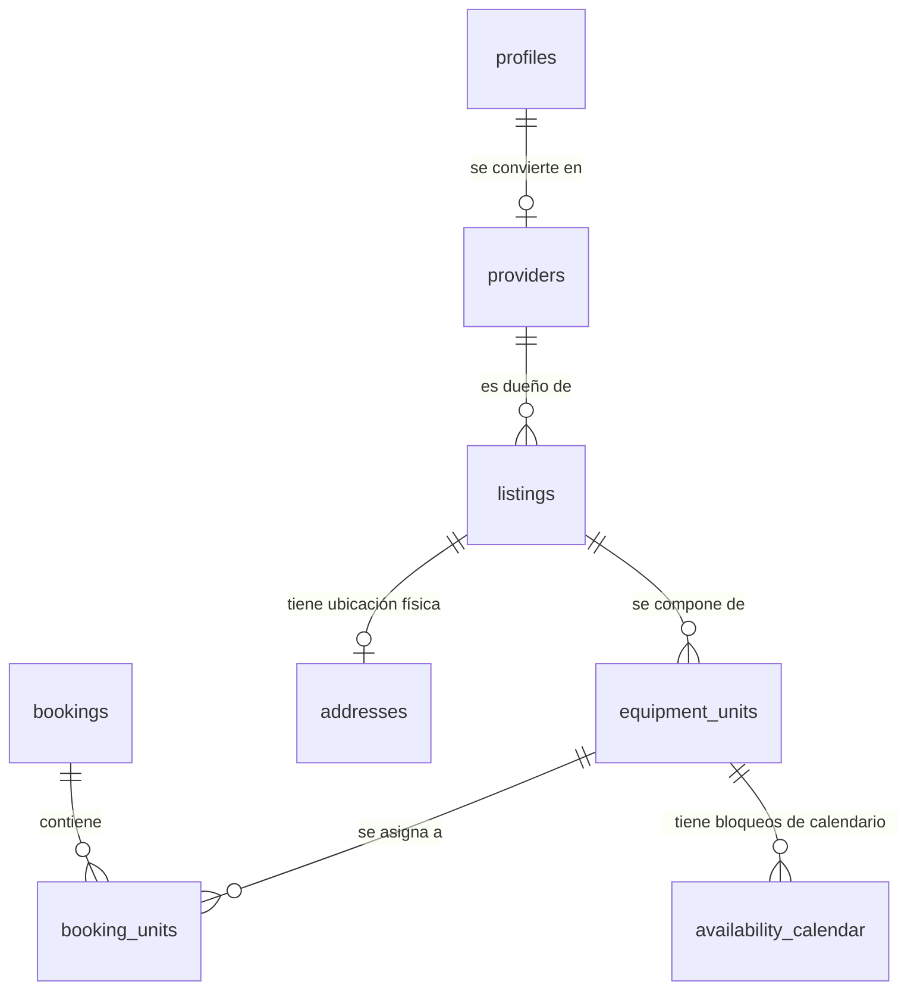

# Manual del Desarrollador y Contexto Arquitectónico: ArtRider

Bienvenido al equipo de ingeniería de ArtRider. Este documento es el contexto definitivo del proyecto. Ha sido diseñado para ser extremadamente detallado, fiel al código de producción y, sobre todo, fácil de entender. Te ayudará a comprender cómo funciona cada parte del sistema, cómo escribir nuevo código bajo los patrones establecidos y cómo arrancar el proyecto localmente.

---

## Índice
1. [Stack Tecnológico](#stack-tecnológico)
2. [Estructura del Código](#estructura-del-código)
3. [Convención de Archivos del Next.js App Router (.tsx y .ts)](#convención-de-archivos-del-nextjs-app-router-tsx-y-ts)
4. [Modelo de Base de Datos y Relaciones](#modelo-de-base-de-datos-y-relaciones)
5. [Flujos de Trabajo y Lógica Crítica](#flujos-de-trabajo-y-lógica-crítica)
    * [A. Creación de Equipos e Inventario Autoejecutable](#a-creación-de-equipos-e-inventario-autoejecutable)
    * [B. El Motor de Disponibilidad Horaria (Timezone-Safe)](#b-el-motor-de-disponibilidad-horaria-timezone-safe)
    * [C. El Flujo de Checkout e Inmutabilidad Contractual](#c-el-flujo-de-checkout-e-inmutabilidad-contractual)
    * [D. Optimización del Rendimiento (Checkout en 50ms)](#d-optimización-del-rendimiento-checkout-en-50ms)
    * [E. Seguridad de Cancelación y Reglas de Negocio](#e-seguridad-de-cancelación-y-reglas-de-negocio)
6. [El Selector de Fechas del Calendario](#el-selector-de-fechas-del-calendario)
7. [Cómo Correr el Proyecto (Comandos y Variables)](#cómo-correr-el-proyecto-comandos-y-variables)
8. [Guía de Estilos y Buenas Prácticas de Codificación](#guía-de-estilos-y-buenas-prácticas-de-codificación)

---

## Stack Tecnológico
ArtRider es una plataforma SaaS de alquiler de equipos que utiliza las tecnologías más robustas del desarrollo web moderno:

* **Framework Principal**: Next.js 16 (App Router). Aprovecha al máximo los React Server Components (RSC) para la renderización del lado del servidor y Server Actions para mutaciones seguras sin necesidad de APIs intermedias.
* **Lenguaje**: TypeScript con tipado estricto en toda la lógica de datos y servicios.
* **Estilos**: TailwindCSS para interfaces responsivas, fluidas y coherentes.
* **Base de Datos y Seguridad (BaaS)**: Supabase (Postgres) con políticas de Row Level Security (RLS) para delegar la autorización a nivel de filas directamente en la base de datos.
* **Procesamiento de Pagos y KYC**: Stripe para la captura segura de cobros y el flujo de verificación de identidad obligatorio.
* **Emails Transaccionales**: Resend para notificaciones y correos instantáneos.

---

## Estructura del Código
El repositorio sigue una arquitectura limpia basada en separación de conceptos:

```bash
art-rider/
├── app/                  # Capa de Presentación y Rutas (Next.js App Router)
│   ├── api/              # Endpoints REST (ej. Webhooks de Stripe en /api/stripe)
│   ├── bookings/         # Flujo de confirmación y Checkout de reservas (/new)
│   ├── explore/          # Interfaz de búsqueda de catálogo público
│   ├── listings/         # Páginas de detalle de cada producto (/[id])
│   ├── provider/         # Dashboard del Proveedor (inventario, catálogo, settings)
│   └── dashboard/        # Dashboard del Cliente (alquileres, favoritos)
├── components/           # Componentes de React
│   ├── ui/               # Botones, diálogos y calendarios de uso común (Shadcn)
│   └── features/         # Componentes con lógica y estado de negocio (BookingCard, KYC)
├── services/             # Capa de Lógica de Negocio (Server Actions)
│   ├── authService.ts          # Inicio de sesión, registros y perfiles
│   ├── listingsService.ts      # Registro y mutación de publicaciones de equipos
│   ├── bookingsService.ts      # Ciclo de vida de alquileres, transacciones y checkout
│   ├── availabilityService.ts  # Motor matemático de cálculo de fechas disponibles
│   └── identityService.ts      # Estatus de adquisición KYC (Know Your Customer)
└── lib/                  # Inicialización de clientes e integraciones externas
    ├── supabaseServer.ts # Cliente de Supabase bajo sesión de usuario (Valida cookies y RLS)
    ├── supabaseAdmin.ts  # Cliente de Supabase administrativo (Bypass de RLS con Service Key)
    └── resend.ts         # Integración para envíos de correo con Resend
```

---

## Convención de Archivos del Next.js App Router (.tsx y .ts)
Next.js utiliza convenciones basadas en nombres de archivos específicos dentro de la carpeta `app/` para definir las páginas, los contenedores y los estados de carga de la aplicación. Es crucial entender cómo se estructuran estos archivos en ArtRider:

### 1. page.tsx (La Vista o Página Única)
* **Propósito**: Define la interfaz de usuario final y única que se expone al usuario al navegar a una ruta determinada. Cada directorio dentro de `app/` que deba ser accesible como una URL contiene este archivo.
* **Funcionamiento en ArtRider**: Por defecto, son **React Server Components (RSC)**. Esto significa que ejecutan las consultas a la base de datos de Supabase en el servidor antes de enviar el HTML al navegador, eliminando la necesidad de loaders complicados de cara al cliente y acelerando el SEO. Ejemplo: `app/listings/[id]/page.tsx` para cargar los detalles del equipo.

### 2. layout.tsx (El Contenedor o UI Compartida)
* **Propósito**: Define una interfaz compartida para un segmento de ruta y todas sus subrutas anidadas. A diferencia de las páginas, los layouts no vuelven a montarse (no pierden su estado de React) cuando el usuario navega entre páginas hijas.
* **Funcionamiento en ArtRider**: 
  * El archivo raíz `app/layout.tsx` contiene la estructura global (`html`, `body`), la configuración de tipografía y los proveedores globales de contexto.
  * Los layouts secundarios como `app/provider/layout.tsx` definen barras de navegación laterales permanentes (sidebar) y menús de control que persisten a lo largo de las distintas subpáginas del proveedor.

### 3. loading.tsx (UI de Carga Automática)
* **Propósito**: Es una interfaz de carga instantánea construida sobre React Suspense. Se muestra automáticamente en el cliente mientras la página hermana (`page.tsx`) resuelve la obtención de datos asíncronos del lado del servidor.
* **Funcionamiento en ArtRider**: En paneles densos de información (como `app/provider/inventory/loading.tsx` o `app/provider/catalog/loading.tsx`), este archivo renderiza esqueletos de carga visuales (Skeletons) con TailwindCSS. Al completarse la consulta asíncrona de base de datos, el skeleton es reemplazado inmediatamente por la página final de forma transparente y suave para el usuario.

### 4. error.tsx (Manejo Seguro de Excepciones)
* **Propósito**: Actúa como un boundary de error (Error Boundary) de React para interceptar y capturar fallas inesperadas que ocurran en tiempo de ejecución dentro de una ruta.
* **Funcionamiento en ArtRider**: Si una Server Action falla críticamente o la conexión de base de datos da un error irrecuperable en un Server Component, `error.tsx` renderiza un mensaje amigable y limpio en lugar de romper toda la interfaz de la aplicación. Incluye una función `reset()` para que el usuario pueda intentar recargar la sección sin abandonar la página actual.

### 5. not-found.tsx (Manejo del Error 404)
* **Propósito**: Define la interfaz gráfica que se renderiza cuando se ejecuta explícitamente la función `notFound()` en un componente o Server Action, o cuando el cliente navega a una ruta que no coincide con ninguna página.
* **Funcionamiento en ArtRider**: Si se busca un equipo con un ID que ya no existe en la base de datos, el Server Component en `listings/[id]/page.tsx` llama a `notFound()`, y Next.js redirige automáticamente al usuario a una pantalla limpia de 404 controlada y estilizada con la marca.

### 6. route.ts (Controladores de Rutas API)
* **Propósito**: Define endpoints y controladores API tipo REST (Route Handlers) que responden a peticiones HTTP externas (GET, POST, PUT, DELETE).
* **Funcionamiento en ArtRider**: Principalmente se utilizan para la integración y escucha asíncrona de pasarelas de pago de terceros, como el webhook seguro en `app/api/stripe/webhooks/route.ts`, que procesa los estados de pago de Stripe.

---

## Modelo de Base de Datos y Relaciones
El diseño relacional separa la definición comercial del equipo de su existencia física, lo que permite la consistencia y escalabilidad en el inventario.



### Detalle de las Entidades Críticas:
1. **`profiles` / `providers`**: Los perfiles vinculan al usuario de Supabase Auth con los datos de negocio. Si el usuario se registra como proveedor, se le crea un registro en `providers` con estados `'pending' | 'approved' | 'suspended'`.
2. **`listings`**: La oferta comercial (ej: "Parlante JBL de 1500W" a $25.00/día). Almacena descripción, categoría e imagen de portada.
3. **`equipment_units` (Inventario Real)**: El inventario tangible. Cada unidad física tiene un número de serie único y su estado de disponibilidad real (`'AVAILABLE' | 'RENTED' | 'MAINTENANCE'`).
4. **`bookings`**: Cabecera de la transacción de alquiler. Almacena el total de la reserva, el rango de fechas contratado y **snapshots de inmutabilidad** en formato JSONB (`snapshot_listing`, `snapshot_address`, `snapshot_provider`).
5. **`booking_units`**: Detalle intermedio que vincula una reserva (`bookings`) con la unidad física exacta (`equipment_units`) y congela el precio por día.
6. **`availability_calendar`**: Bloqueos manuales creados por el proveedor para fines de mantenimiento o uso propio.

---

## Flujos de Trabajo y Lógica Crítica

### A. Creación de Equipos e Inventario Autoejecutable
* **Ubicación**: `services/listingsService.ts` -> `createListing`
* **Cómo funciona**:
  1. El proveedor llena el formulario (título, marca, modelo, precio diario, ubicación/ciudad, provincia e imagen de portada).
  2. El precio diario ingresado en dólares se multiplica por 100 para **guardarse estrictamente en centavos** en la base de datos (evitando errores de punto flotante en cálculos futuros).
  3. La imagen de portada se sube al bucket de almacenamiento `listing-covers` usando el cliente administrativo para garantizar permisos de carga.
  4. Se crea la ubicación geográfica en la tabla `addresses` y luego el registro del equipo en `listings`.
  5. **Auto-Aprovisionamiento**: Dentro de la misma transacción, el sistema inserta una fila por defecto en `equipment_units` con número de serie único derivado de su ID (`SN-SHORTID`) y con estado `AVAILABLE`. Esto hace que el equipo esté disponible para alquiler inmediatamente sin pasos adicionales.

---

### B. El Motor de Disponibilidad Horaria (Timezone-Safe)
* **Ubicación**: `services/availabilityService.ts` -> `getUnavailableDates`
* **Cómo funciona**:
  * Para determinar si un equipo está libre en ciertas fechas, el motor debe evaluar el inventario consolidado.
  * Busca las unidades físicas (`equipment_units`) del listing.
  * Recupera las reservas en `booking_units` asociadas a esas unidades cuyo estado no esté cancelado ni archivado, así como los bloqueos manuales en `availability_calendar`.
  * **Timezone Safety**: Los desfases de zonas horarias entre servidores (UTC) y navegadores locales suelen romper calendarios. Para evitar esto, todas las fechas se calculan y guardan en formato de cadena plana sin hora (`YYYY-MM-DD`). La librería `date-fns` en el frontend y el backend interpretan las fechas respetando siempre la representación local estricta.

---

### C. El Flujo de Checkout e Inmutabilidad Contractual
* **Ubicación**: `services/bookingsService.ts` -> `createBooking`
* **Cómo funciona (Paso a Paso)**:
  1. **Autenticación y Propiedad**: Se valida la sesión del usuario. Se impide que el cliente intente alquilar su propio equipo.
  2. **Validación contra Duplicación de Solicitudes Pendientes**:
     Para evitar spam de reservas cruzadas, consultamos la base de datos bajo sesión segura:
     ```typescript
     const { data: existingPending } = await adminSupabase
       .from("booking_units")
       .select(`
         id,
         booking:bookings!inner(id, client_id, start_date, end_date, status),
         equipment_unit:equipment_units!inner(listing_id)
       `)
       .eq("bookings.client_id", user.id)
       .eq("bookings.status", "AWAITING_SIGNATURES")
       .eq("equipment_units.listing_id", listingId);
     ```
     Si el cliente ya tiene una reserva pendiente (`AWAITING_SIGNATURES`) para ese mismo equipo en ese mismo rango de fechas, la acción es rechazada de inmediato.
  3. **Re-validación de Fechas**: Se vuelve a validar la disponibilidad de fechas en el servidor con `checkAvailability` justo antes de insertar, previniendo condiciones de carrera.
  4. **Bypass Seguro de RLS (Row Level Security)**:
     * Por diseño de seguridad, un cliente común no tiene permiso en Supabase (RLS) para buscar el inventario físico global de otros proveedores ni insertar registros de reserva de sus unidades.
     * Para resolver esto, `createBooking` utiliza el **cliente administrador** (`createSupabaseAdminClient()`) de forma estrictamente controlada desde el servidor. El cliente administrador localiza la primera unidad libre física en `equipment_units` e inserta la relación en `booking_units` de forma robusta. Si no hay unidades disponibles en inventario, el checkout arroja un error controlado y bloquea la operación.
  5. **Snapshots de Inmutabilidad Contractual**:
     * Al insertarse con éxito en `booking_units`, se dispara automáticamente el trigger PostgreSQL `trg_booking_unit_snapshot` el cual ejecuta `populate_booking_listing_snapshot()`.
     * Esta función copia toda la información descriptiva, precio del equipo y dirección a las columnas JSONB `snapshot_listing` y `snapshot_address` en la cabecera de `bookings`.
     * El trigger `trg_prevent_snapshot_mutation` bloquea cualquier cambio futuro en estas columnas JSONB. Esto garantiza que aunque el proveedor actualice los datos o elimine el equipo de su catálogo en el futuro, el contrato de alquiler original firmado por el cliente permanezca intacto, sirviendo como evidencia legal inalterable.

---

### D. Optimización del Rendimiento (Checkout en 50ms)
* **Cómo funciona**:
  * El envío de notificaciones y correos transaccionales a través de APIs de red externas (como Resend) suele tomar de 500ms a 2 segundos en completarse.
  * Para ofrecer una experiencia de usuario instantánea y evitar pantallas de carga molestas, envolvemos todas las tareas secundarias (creación de notificaciones de base de datos y llamadas HTTP a la API de Resend) dentro de una **IIFE asíncrona (Immediate Invoked Function Expression)** que corre en segundo plano sin `await` en el hilo principal:
    ```typescript
    (async () => {
      try {
        // Envíos de notificaciones, correos y APIs externas aquí...
      } catch (err) {
        console.error("Error en notificaciones en segundo plano:", err);
      }
    })();
    ```
  * El servidor responde `success: true` en menos de 50ms justo después de asegurar la base de datos, y despacha al cliente inmediatamente mientras las notificaciones e correos se completan en background.

---

### E. Seguridad de Cancelación y Reglas de Negocio
* **Ubicación**: `services/bookingsService.ts` -> `cancelBooking`
* **Regla estricta**: Un cliente **únicamente** puede cancelar su reserva si el estado de esta es `"AWAITING_SIGNATURES"` (Pendiente de firmas/aprobación). Bajo ninguna circunstancia se le permite cancelar una reserva ya pagada (`PAID`) o activa.
* **Borde de Seguridad**:
  * **Backend**: `cancelBooking` valida el estado y rechaza cualquier petición cuyo estado sea distinto a `"AWAITING_SIGNATURES"`.
  * **Frontend**: En `ClientBookingsSection.tsx`, el botón "Cancelar reserva" está condicionado a `booking.status === "AWAITING_SIGNATURES"`, por lo que es invisible para reservas pagadas.

---

## El Selector de Fechas del Calendario
* **Ubicación**: `components/features/bookings/BookingCard.tsx`
* El calendario cuenta con dos protecciones UX muy avanzadas:
  1. **Inicio de Hoy Seguro**: Para inhabilitar fechas del pasado, en lugar de usar `before: new Date()` (que deshabilitaba la fecha de hoy a partir del mediodía por desfase de hora), se calcula el inicio neto del día actual a medianoche (`todayStart.setHours(0,0,0,0)`), asegurando que el día en curso sea siempre elegible.
  2. **Resolución Inteligente de Rangos Cruzados**:
     * Si el usuario tiene una fecha seleccionada y hace un clic en otra fecha anterior o posterior que cruza un día reservado en el medio, el manejador `onSelect` intercepta el evento y, en lugar de congelar la selección o forzar la fecha vieja, **establece el día exacto clickeado (`selectedDay`) como el nuevo punto de partida (`from`)**:
       ```typescript
       setDateRange({ from: selectedDay, to: undefined });
       ```
     * Esto proporciona una fluidez total en la interacción sin bloqueos de interfaz.

---

## Cómo Correr el Proyecto (Comandos y Variables)

### 1. Variables de Entorno (`.env`)
Debes crear un archivo `.env` en la raíz del proyecto basándote en la siguiente plantilla:

```env
# Supabase Credenciales Públicas (Acceso en cliente y servidor)
NEXT_PUBLIC_SUPABASE_URL=https://your-project-id.supabase.co
NEXT_PUBLIC_SUPABASE_ANON_KEY=eyJhbGciOiJIUzI1NiIsInR5cCI6IkpXVCJ9...

# Supabase Llave de Servicio (Bypass de RLS - EXCLUSIVA DEL SERVIDOR)
SUPABASE_SERVICE_ROLE_KEY=eyJhbGciOiJIUzI1NiIsInR5cCI6IkpXVCJ9...

# Stripe Credenciales
STRIPE_SECRET_KEY=sk_test_...
NEXT_PUBLIC_STRIPE_PUBLISHABLE_KEY=pk_test_...
STRIPE_WEBHOOK_SECRET=whsec_...

# Resend Envío de Emails
RESEND_API_KEY=re_...
RESEND_FROM_EMAIL=onboarding@resend.dev
```

> [!CAUTION]
> **SEGURIDAD CRÍTICA**: Nunca bajo ninguna circunstancia expongas `SUPABASE_SERVICE_ROLE_KEY` o `STRIPE_SECRET_KEY` en componentes con la directiva `"use client"`. Estas llaves poseen privilegios totales de administración.

### 2. Comandos Principales

Utilizamos `pnpm` para gestionar el monorepositorio y las dependencias de forma eficiente.

* **Instalación de Dependencias**:
  ```bash
  pnpm install
  ```

* **Ejecutar el Servidor de Desarrollo**:
  ```bash
  pnpm dev
  ```
  Arranca el servidor local de Next.js en `http://localhost:3000`.

* **Compilación de Producción e Inspección de Tipos**:
  ```bash
  pnpm build
  ```
  Este comando ejecuta la compilación optimizada en producción utilizando **Next.js Turbopack** y valida de forma estricta los tipos de TypeScript. Es obligatorio correrlo y verificar que termine con **Exit Code: 0** antes de subir cualquier cambio a producción o abrir un Pull Request.

---

## Guía de Estilos y Buenas Prácticas de Codificación

Al colaborar en el código de ArtRider, asegúrate de cumplir con los siguientes lineamientos de calidad:

1. **Server Actions como Capa de Control**: Toda lógica que escribas que interactúe con la base de datos o APIs externas debe vivir en la carpeta `/services` en forma de Server Actions con la directiva `"use server"` al inicio del archivo. Los componentes de React solo deben importar y llamar a estas funciones.
2. **Separación Comercial de Unidades**: Nunca asocies una reserva directamente a la tabla `listings`. Utiliza siempre el flujo relacional de inventario (`equipment_units` -> `booking_units` -> `bookings`) para garantizar la consistencia en el stock.
3. **Manejo de Precios en Centavos**: Todos los cálculos matemáticos, comisiones y almacenamiento de montos deben ser estrictamente en **números enteros de centavos** (ej. almacenar `$25.50` como `2550`). La visualización en dólares con decimales queda delegada exclusivamente al formateador del frontend.
4. **Preservar Comentarios y Estilo**: Mantén el estilo de comentarios descriptivos y la legibilidad en TypeScript para facilitar la lectura del código por parte de otros ingenieros.

---

¡Felicidades, ahora tienes todo el mapa mental y técnico del sistema! Estás listo para codificar y llevar a ArtRider al siguiente nivel.
